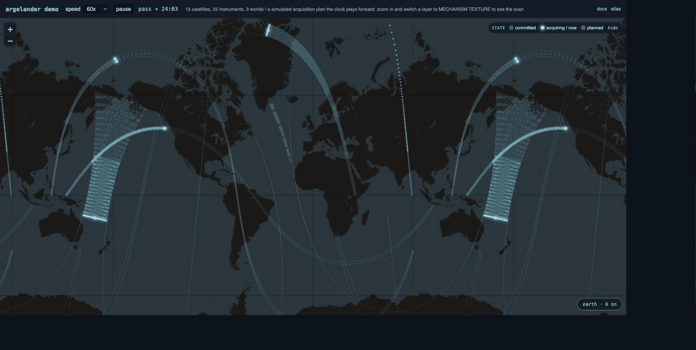
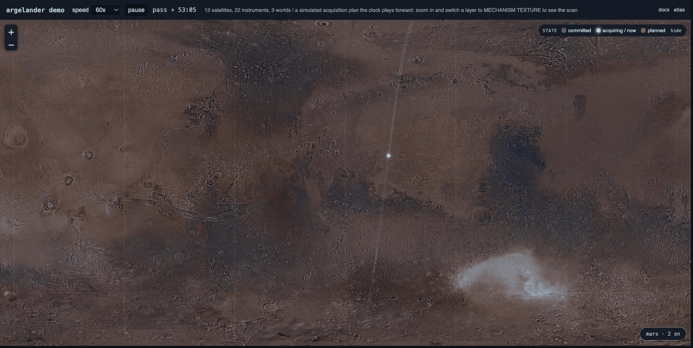
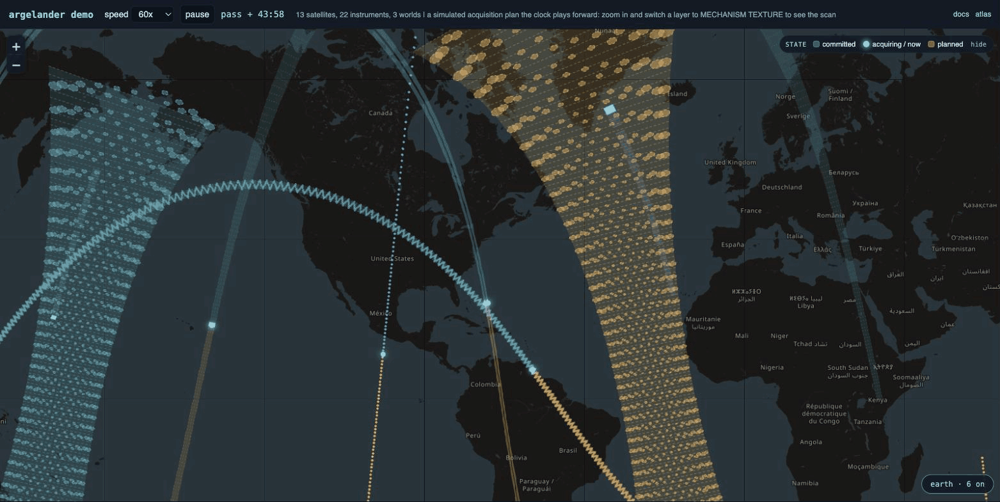

# Argelander

Acquisition geometry engine (functional identity: AGE). Instrument models and ephemerides in, time-tagged footprint strips out. Renderer adapters paint them.

The product line: Cosmolabe is what you see, Bessel is what computes, Argelander is what surveys.



## See it, use it

Instrument models and ephemerides in, time-tagged footprint strips out, painted on a map. The live Leaflet demo (SGP4 and pre-sampled footprints over Earth, the Moon, and Mars) is the true current visualization state, the engine's own output, and ships on GitHub Pages. The 21-family atlas (`apps/atlas/index.html`, no build, no server) is a separate thing: a hand-authored design exploration of how each geometry and treatment should read, not the Argelander engine's rendering. To put your own footprint on a map, start with the [layer configuration guide](docs/configuring-layers.md); the short path is one call:

```ts
import { passStrips } from 'argelander-core';
import { AcquisitionLayer } from 'argelander-leaflet';

const strips = await passStrips(provider, {
  target: 'ISS', observer: 'EARTH', frame: 'ITRF93', bodyRadiusKm: 6371,
  instrumentId: 'ISS/imager', generatedBy: 'my-app',
  swathHalfWidthKm: 80, windows: [[epochEt, epochEt + 5400]], stepSec: 15,
});
new AcquisitionLayer(strips).addTo(map);
```

The same engine paints any world its states describe, and zooming in resolves each strip into its acquisition mechanism: the individual footprints, the scan sweep, the state of every one.

| Planetary reach | Mechanism texture |
| --- | --- |
|  |  |

## The name

Friedrich Wilhelm Argelander (1799 to 1875) was Bessel's doctoral student and assistant at Konigsberg, and the maker of the Bonner Durchmusterung, the survey that fixed 324,198 stars from the north celestial pole down to two degrees below the equator, complete to about magnitude 9.5, positions good to roughly an arcminute. It was the last great star map made without photography, and its method is why this engine carries his name. Argelander held a meridian telescope fixed at the mean declination of a zone and let the Earth's rotation carry stars across a stationary reticle line, recording each transit's time and where along the line it crossed. A fixed cross-track line, along-track motion supplied by the platform, coverage accumulated as time-tagged crossings: that is a pushbroom sensor, and the Bonner Durchmusterung is its ur-form. Atlas tile 1, the family every other family is measured against, is exactly this geometry.

What the engine provides is that method generalized and turned onto acquisition. Argelander swept one geometry across the sky to build a reproducible catalog; this engine models twenty-one acquisition geometries sweeping bodies to build reproducible coverage: time-tagged footprint strips, each carrying the provenance of the authority that produced its states, deterministic enough that the conformance suite replays the atlas numerically. It answers the surveyor's question (what did this instrument cover, and when) rather than the analyst's (what is that target), which is the division of labor the product line above names: compute below, survey here, render above.

The boundary is his too. Argelander accepted arcminute positions in exchange for comprehensive, systematic coverage and left sub-arcsecond precision to the lineage of his teacher, who measured the first stellar parallax. This engine makes the same trade by charter: rendering-grade analytic footprint geometry, with analysis-grade intercepts delegated to a pluggable service and the states themselves arriving from providers rather than computed here. Survey-grade coverage, provenance attached, precision deferred. That is what Argelander did with a fixed telescope and a clock, and it is what this repository does with instrument models and ephemerides.

## What lives here

| Path | Purpose |
| --- | --- |
| `packages/argelander-core` | Renderer-agnostic engine: strip schema, instrument models and samplers for all 21 families, pass orchestration, validation. Zero runtime dependencies. |
| `packages/argelander-providers` | Standalone StateProviders below the seam: near-earth SGP4 from source, pre-sampled playback, CZML, worker-port and HTTP transports (ADR-0008, ADR-0009). |
| `packages/argelander-leaflet` | Leaflet adapter (MMGIS 2D Map first target): six treatments, the decay trail, the pass clock. Phase 1. |
| `packages/argelander-three` | Three.js adapter (MMGIS Globe and Cosmolabe hosts). Phase 2, blocked on ADR-0006. |
| `packages/argelander` | Umbrella package re-exporting core (claims the npm name). |
| `apps/atlas` | The Acquisition Geometry Atlas: a hand-authored design-exploration study of the 21 geometry families and 6 treatments, how each should read. Not the engine's output: the samplers were transcribed from its tiles, but the true current visualization is `apps/demo-leaflet`. |
| `apps/demo-leaflet` | The true current visualization state: the engine's own live footprints across three worlds, Earth from an SGP4 worker, Moon and Mars pre-sampled over NASA Trek tiles, rendered through argelander-leaflet. Phase 1. |
| `specs/` | SPEC-STRIP, SPEC-INSTRUMENT-MODEL, SPEC-PROVIDER. Source of truth; code follows spec. |
| `docs/` | The acquisition-geometry survey and the layer-configuration guide. |
| `adr/` | Architecture decision records. |
| `goals/` | Phase goal files with exit criteria. Claude Code executes these. |

## Quickstart

```bash
corepack enable
pnpm install
pnpm verify        # style gate + typecheck + tests
pnpm docs:build    # renders dist/site: guide, specs, ADRs, API reference, atlas, live demo
```

Open `apps/atlas/index.html` in a browser for the atlas: no build step, no server. The full site (atlas, the three-world Leaflet demo, the configuring-layers guide, specs, ADRs, and the generated API reference) is what `pnpm docs:build` assembles and the Pages workflow deploys.

## Governance

Apache-2.0. DCO sign-off required (`git commit -s`). ADR discipline: any new runtime dependency in core, any seam change, any schema change gets an ADR first. Destination recorded in ADR-0001: NASA-AMMOS or the Open Mission Foundation scope; personal org until then.
